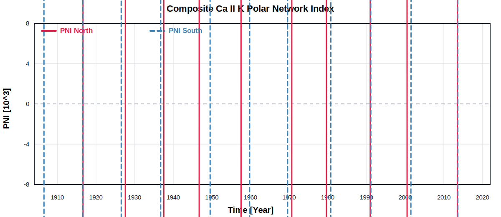
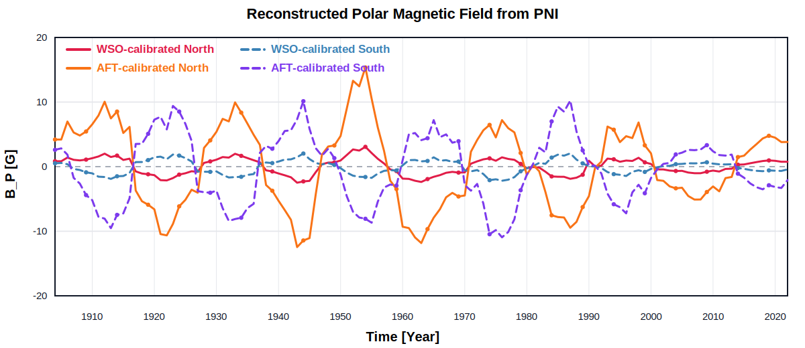

# Ca ii K Polar Network Index of the Sun: A Proxy for Historical Polar Magnetic Field

**Authors:** Mishra D.K., Jha B.K., Chatzistergos T., Ermolli I., Banerjee D., Upton L.A.

## Abstract

The Sun's polar magnetic field is pivotal in understanding solar dynamo processes and forecasting future solar cycles. However, direct measurements of the polar field have only been available since the 1970s. The chromospheric Ca ii K polar network index (PNI; the fractional area of the chromospheric network regions above a certain latitude) has recently emerged as a reliable proxy for polar magnetic fields. In this study, we derive PNI estimates from newly calibrated, rotation-corrected Ca ii K observations from the Kodaikanal Solar Observatory (1904-2007) and modern data from the Rome Precision Solar Photometric Telescope (2000-2022). We use both of those Ca ii K archives to identify polar network regions with an automatic adaptive threshold segmentation technique and calculate the PNI. The PNI obtained from both the archives shows a significant correlation with the measured polar field from the Wilcox Solar Observatory (Pearson correlation coefficient r > 0.93) and the derived polar field based on an Advective Flux Transport Model (r > 0.91). The PNI series also shows a significant correlation with faculae counts derived from Mount Wilson Observatory observations (r > 0.87) for both Kodaikanal Solar Observatory and Rome Precision Solar Photometric Telescope data. Finally, we use the PNI series from both archives to reconstruct the polar magnetic field over a 119 yr long period, which includes the last 11 solar cycles (Cycles 14-24). We also obtain a relationship between the amplitude of solar cycles (in 13 month smoothed sunspot number) and the strength of the reconstructed polar field at the preceding solar cycle minimum to validate the prediction of the ongoing solar cycle, Cycle 25.

## Data

| File | Time range | Columns | Description |
| --- | --- | --- | --- |
| [`data/KoSO_CaIIK_PNI_composite_yearly.txt`](data/KoSO_CaIIK_PNI_composite_yearly.txt) | 1904-2022 | Year, PNI North, error in PNI North, PNI South, error in PNI South | Yearly composite PNI series merging Ca ii K measurements from KoSO and PSPT-R. |
| [`data/KoSO_CaIIK_polarfield_yearly.txt`](data/KoSO_CaIIK_polarfield_yearly.txt) | 1904-2022 | Year, WSO-calibrated polar field North and error, WSO-calibrated polar field South and error, AFT-calibrated polar field North and error, AFT-calibrated polar field South and error | Yearly polar magnetic field reconstructed from PNI and calibrated with WSO and AFT polar fields. |

**Abbreviations:** PNI = Polar Network Index; KoSO = Kodaikanal Solar Observatory; PSPT-R = Rome Precision Solar Photometric Telescope; WSO = Wilcox Solar Observatory; AFT = Advective Flux Transport Model.

## Plots

